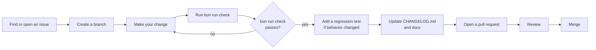
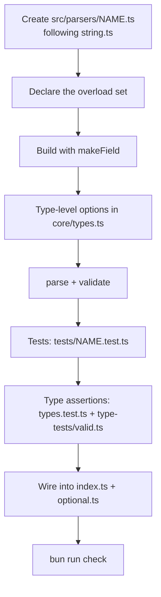

<h1 align="center">Contributing to `envy-ts`</h1>

<p align="center">
  <i>Thanks for helping make <code>envy-ts</code> better.</i>
</p>

<p align="center">
  <code><b>bun run check</b></code>
  &nbsp;·&nbsp; one command &nbsp;·&nbsp; the whole gate
</p>

This guide documents the toolchain, the commands every change must satisfy, and
the conventions for contributing parsers and regression tests. It is written to
get you from "I'd like to help" to "merged" with as little friction as possible.

---

## Why contribute

`envy-ts` is **deliberately small** — and small projects thrive on careful
contributions. A well-tested parser, a sharpened error message, a documentation
fix that saves someone an hour: these are the changes that compound.

What you can expect in return:

- **A fast, human review.** Changes are small and focused, so reviews are quick.
- **A strict but fair gate.** `bun run check` is the whole bar — nothing hidden.
- **Zero-dependency discipline.** Your contribution ships in a package that
  stays auditable and tiny.

## How contributions flow



> **Start with an issue.** For anything beyond a trivial fix, opening an issue
> first means we agree on the shape before the code exists — it saves everyone
> rework.

---

## Prerequisites

| Tool | Version | Needed for |
|---|---|---|
| [Node.js](https://nodejs.org) | **≥ 18** | The package's engines floor |
| [Bun](https://bun.sh) | ≥ 1.x | The primary toolchain; installs and the `check` suite; `prepublishOnly` |
| [Deno](https://deno.com) | ≥ 2.x | Only the Deno smoke test (`bun run verify:deno`) |

Only install what you need. If you are not touching Deno or the loader, Bun
alone is enough.

---

## Set up

Two lockfiles are maintained on purpose — one per supported toolchain track:

```bash
bun install   # Bun track -> updates bun.lock
npm install   # Node track -> updates package-lock.json
```

Both tracks are validated in CI. **When you change dependencies, update both
lockfiles** and make sure both `bun install --frozen-lockfile` and `npm ci`
succeed.

The package has **zero runtime dependencies** — that is a hard contract. All
development dependencies live in `devDependencies`; never rely on hoisted
transitive packages.

---

## The toolchain, at a glance

One command does it all:

```bash
bun run check    # typecheck + lint + format + test + test:types + build + verify:package + publint
```

Run the pieces individually while you work — they are fast:

| Command | What it does |
|---|---|
| `bun run typecheck` | `tsc --noEmit` over `src`, `tests`, `examples` |
| `bun run lint` | Biome check (lint + format + import organization) |
| `bun run format` | Biome format in-place |
| `bun run format:check` | Biome format check (CI-safe) |
| `bun run test` | Vitest unit/security/adapter/browser suites |
| `bun run test:types` | Positive (`valid`) + negative (`invalid`) compile-time suites |
| `bun run test:coverage` | Vitest with enforced thresholds (lines ≥ 95, statements ≥ 95, branches ≥ 90, functions ≥ 95) |
| `bun run build` | tsup → ESM + CJS + `.d.ts` + `.d.cts` + sourcemaps into `dist/` |
| `bun run verify:package` | Packs the tarball, installs it into throwaway projects, runs runtime ESM/CJS smokes + the full TypeScript consumer matrix against the **packed artifact** |
| `bun run verify:deno` | Deno smoke against the built `dist/index.js` |
| `publint` / `npx publint` | Package-lint of exports/types (must report "All good!") |

> **Run `bun run check` before opening a PR.** It is exactly what CI runs, so
> if it passes locally, the merge gate is already met.

---

## How to add a parser

Parsers follow one template, `src/parsers/string.ts`. The pattern is
deliberately mechanical — copy it and you cannot go far wrong.



1. **Create `src/parsers/<name>.ts`**, following `src/parsers/string.ts` as the
   template:
   - Declare the overload set — `(name)`, `(name, default)`, `(name, undefined)`,
     `(name, { default }/options)`, `(name, { optional: true })`.
   - Build the field with `makeField`. Fields are **frozen** by `makeField` — do
     not mutate them afterwards.
   - Add your type-specific options to `src/core/types.ts`.
   - `parse` throws `EnvParseError` for invalid input; `validate` returns a
     reason string or `null`.
2. **Add runtime tests** in `tests/<name>.test.ts` covering accept/reject tables,
   trimming, empty-as-missing, defaults, optionality, bounds, and redaction if
   the values can be sensitive.
3. **Add type-level assertions** to `tests/types.test.ts` and
   `type-tests/valid.ts`.
4. **Wire the maker** into `src/index.ts` (named export + `env` namespace
   import) and `src/optional.ts` if an optional variant makes sense.
5. **Run `bun run check`.**

---

## How to add a regression test

Copy the `BUG-*` / `IMP-*` naming convention already used in the suite:

```ts
it("... (BUG-0012)", () => { ... });
```

The parenthetical id makes the regression **auditable**. Every bug fix must land
with its regression test in the same change.

Security/adversarial behavior belongs in `tests/security.test.ts`; adapter
behavior belongs in `tests/adapters.test.ts`.

---

## Verify the package surface

`bun run verify:package` is the release gate. It asserts that:

- the tarball contains exactly `dist/**`, `README.md`, `LICENSE`, `package.json`
  (no `src/`, `tests/`, `examples/`, scripts, configs, or lockfiles);
- runtime `import` and `require` work, including `envy-ts/load`;
- TypeScript consumers compile against the installed tarball in: bundler ESM,
  node16 ESM, nodenext ESM, node16 CJS (`.cts`), nodenext CJS, a type-less CJS
  package under nodenext, and legacy node10 resolution — with `envy-ts/load` in
  each of them.

Run it after **any** change to `package.json`, `tsup.config.ts`, or the public
export surface.

---

## Dependency and lockfile policy

- **Zero runtime dependencies is a hard contract.** Do not add one without
  seriously questioning whether it earns a place on the tree-shaken critical
  path.
- Every change to `devDependencies` updates **both** `bun.lock` and
  `package-lock.json`, and both `bun install --frozen-lockfile` and `npm ci`
  must pass in CI.

---

## Before you open a pull request

A quick final pass:

- [ ] `bun run check` passes — typecheck, lint, format, unit tests, type tests,
      build, and the packed-package consumer matrix.
- [ ] New public behavior ships with **regression tests** *and* **documentation**
      (README or JSDoc) in the same PR.
- [ ] `CONTRIBUTING.md`, `SECURITY.md`, and `CHANGELOG.md` are updated where
      appropriate.
- [ ] Line endings stay LF (enforced by `.gitattributes`); `format:check` passes.

> **One PR, one idea.** Small, focused changes review faster than large,
> unfocused ones — and they are far more likely to land.

### What stays out of scope

`envy-ts` is deliberately not a batteries-included config framework. If your
change pulls toward `.env` watching, automatic runtime detection, schema
instantiation, or any hidden I/O, pause and open an issue first — it may be
intentionally out of scope (see [README → Real, honest limits](./README.md#real-honest-limits)).

---

## Getting help

- **Ask in an issue** — the issue tracker is the public forum; questions are welcome.
- **Security matters** — report vulnerabilities **privately** via
  [SECURITY.md](./SECURITY.md), never in a public issue.

Be respectful and constructive. Small, focused changes review faster than large
unfocused ones.
