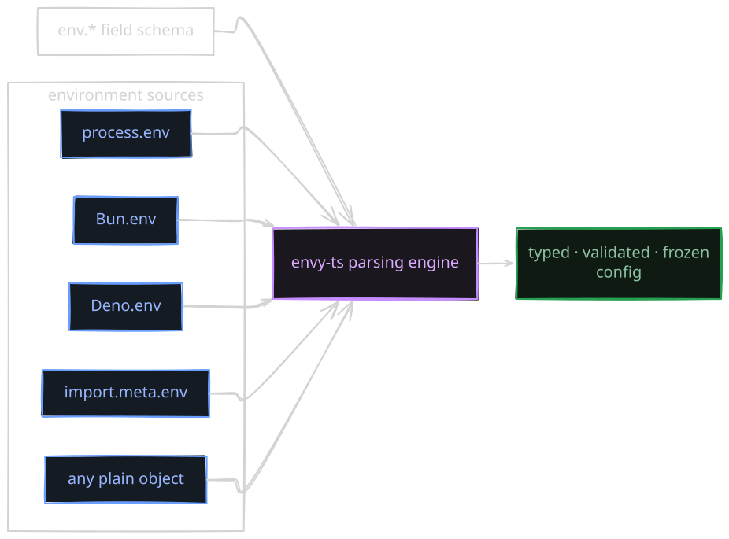

<h1 align="center">envy-ts</h1>

<h3 align="center">Typed environment variables. Zero dependencies. Any runtime.</h3>

<p align="center">
  <i>Tiny, zero-runtime-dependency, type-safe environment variable parsing for
  Node.js, Bun, Deno, and the browser — strict parsing, an aggregated result API,
  typed errors, and automatic secret redaction.</i>
</p>

<p align="center">
  <a href="LICENSE" title="MIT License"></a>
  <a href="package.json" title="zero runtime dependencies"></a>
  <a href="#typescript-that-follows-you" title="strict TypeScript"></a>
  <a href="#any-runtime-one-core" title="core bundle size"></a>
  <a href="package.json" title="engines: >=18">= 18"/></a>
  <a href="LICENSE" title="MIT License"></a>
</p>

<p align="center">
  
</p>

<p align="center">
  <code><b>npm i envy-ts</b></code>
  &nbsp;·&nbsp; Node ≥ 18 &nbsp;·&nbsp; Bun &nbsp;·&nbsp; Deno &nbsp;·&nbsp; Browsers &amp; edge &nbsp;·&nbsp; ESM <b>and</b> CommonJS
</p>

---

## Contents

- [Why envy-ts](#why-envy-ts)
- [The transform](#the-transform)
- [Quick start](#quick-start)
- [How it thinks](#how-it-thinks)
- [What you get](#what-you-get)
- [The API](#the-api)
- [When things break](#when-things-break)
- [Semantics, locked](#semantics-locked)
- [Any runtime, one core](#any-runtime-one-core)
- [Load `.env` files](#load-env-files)
- [TypeScript that follows you](#typescript-that-follows-you)
- [Real, honest limits](#real-honest-limits)
- [Contributing](#contributing)
- [License](#license)

---

## Why envy-ts

Every application starts the same way:

```ts
const port = Number(process.env.PORT)      // "3000abc" → NaN, silently
const debug = Boolean(process.env.DEBUG)   // "false" → true. The string lied to you.
const apiKey = process.env.API_KEY         // string | undefined, never validated
```

`Number()` and `Boolean()` don't validate anything. A typo'd variable turns into a
silent `NaN`, a deployment runs in the wrong mode, a required secret goes missing at
2 a.m. — and the error message that finally surfaces prints the whole API key.

`envy-ts` replaces that ceremony with a schema that is **checked at boot** — not
tripped over at runtime.

---

## The transform

```ts
import { env } from "envy-ts"

const config = env.config({
  port:    env.number("PORT", 3000),
  debug:   env.boolean("DEBUG", false),
  apiKey:  env.string("API_KEY"),
  nodeEnv: env.enum("NODE_ENV", ["development", "production", "test"] as const),
})
```

- `config.port` is a **`number`** — `PORT="3000abc"` throws at boot instead of yielding `NaN`.
- `config.debug` is a **`boolean`** — only `true/false/1/0/yes/no/on/off` (case-insensitive) are accepted.
- `config.nodeEnv` is **`"development" | "production" | "test"`** — a literal union,
  so a typo'd `NODE_ENV` is a compile error *and* a boot-time error.
- `config.apiKey` is a **required string** — but if it ever fails, its raw value is
  **never** printed (more on that in [When things break](#when-things-break)).

Uppercase source names in, lowercase schema keys out — `config.port` reads `PORT`.

---

## Quick start

```sh
npm install envy-ts
```

or with the other package managers you already use:

```sh
bun add envy-ts
deno add npm:envy-ts
```

**Thirty seconds later:**

```ts
import { env } from "envy-ts"

// The whole schema. TypeScript infers config's exact shape.
const config = env.config({
  port:    env.number("PORT", 3000),
  debug:   env.boolean("DEBUG", false),
  apiUrl:  env.string("API_URL"),
  nodeEnv: env.enum("NODE_ENV",
    ["development", "production", "test"] as const, "development"),
})

config.port     // number
config.debug    // boolean
config.apiUrl   // string
config.nodeEnv  // "development" | "production" | "test"

export default config // typed, frozen, ready for your app
```

That's the whole library at work: **fields describe** variables, **parsing** turns them
into values, and one immutable object carries your typed config everywhere.

---

## How it thinks

Two concepts, deliberately separated:

1. **Field makers** — `env.number("PORT", 3000)` *describes* a variable. It returns a
   frozen `Field` descriptor; it never reads any environment and never returns a value.
2. **Parsing** — a field only becomes a value once it is parsed against a *source*.

One pure engine, any source, nothing assumed:

<p align="center">
  
</p>

Because the core never touches `process.env` directly, the same schema runs unchanged
on Node, Bun, Deno, workers, or in the browser with any plain-object source.

---

## What you get

| | | |
|---|---|---|
| **🪶 Tiny** <br/> A pure ESM core of **~5.5 kB gzipped**, zero runtime dependencies. Bundles cleanly for browsers and edge. | **🧩 Type-safe** <br/> Exact inference, including literal unions from `as const`, optional `T \| undefined`, and `URL` objects — verified by a compile-time positive/negative suite. | **⏱️ Fails fast** <br/> `env.config` throws the first broken variable in schema order — at boot, with the variable name and a machine-readable code. |
| **📋 Or collect everything** <br/> `parseEnv` / `env.result` return a non-throwing result with *every* broken variable in one call — one parse, complete picture. | **🌐 Any runtime** <br/> One pure core with explicit adapters for `process.env`, `Bun.env`, `Deno.env`, Vite-style `import.meta.env`, and plain objects. No global sniffing, ever. | **🔒 Secure by contract** <br/> Sensitive-named variables are never echoed in errors. Outputs are frozen, own-property reads make `__proto__` impossible to smuggle in. |

---

## The API

### Field makers

Every maker describes **one variable** and returns a frozen `Field` descriptor. It
reads nothing and returns nothing — schemas are reusable and side-effect-free.

| Call | Behavior | Inferred value |
|---|---|---|
| `env.number("PORT")` | required | `number` |
| `env.number("PORT", 3000)` | default on missing/empty | `number` |
| `env.number("PORT", undefined)` | optional | `number \| undefined` |
| `env.number("PORT", { optional: true })` | optional | `number \| undefined` |
| `env.number("PORT", { default: 3000, min: 1, max: 65535, integer: true })` | default + rules | `number` |

**Makers:** `string` · `number` · `boolean` · `bigint` · `url` · `enum` · `email` ·
`host` · `port` · `json`, plus the whole set under `env.optional.*` for forced
`T | undefined`.

**Common options:** `default`, `optional`, `secret`, `custom`, `description`, `example`.

**Parser-specific options:**

| Parser | Options |
|---|---|
| `number` | `min`, `max`, `integer` |
| `bigint` | `min`, `max` |
| `string` | `trim`, `minLength`, `maxLength`, `pattern` |
| `email` | `maxLength` |
| `host` | `tld` (require a real TLD) |

> **`optional` + `default` → default wins.** An empty value is always treated as
> missing. Whitespace-only is missing for every parser *except* `string` without
> `trim: true`, which keeps values verbatim by design.

### Parsing

A field becomes a value only when parsed against a source. Four entry points, one
shared engine:

```ts
env.config(schema)              // process.env · throws first failure · frozen result
env.result(schema)              // process.env · non-throwing result API
parseEnv(schema, source)        // any source · non-throwing result API
parseEnvOrThrow(schema, source) // any source · throws first failure · frozen result
```

Because they share one engine, the throwing API and the result API can never drift.

### Environment sources

| Adapter | Reads | Notes |
|---|---|---|
| `fromObject(obj)` | any plain object | Universal; read by key, never mutated |
| `fromProcessEnv()` | `process.env` | Node / Bun / Deno-with-`process` |
| `fromBunEnv()` | `Bun.env` → `process.env` → `{}` | Runtime-guarded fallbacks |
| `fromDenoEnv()` | `Deno.env.toObject()` → `process.env` → `{}` | Runtime-guarded fallbacks |
| `fromImportMetaEnv(meta)` | Vite-style `import.meta.env` | Keeps only string values |

Adapters are explicit opt-ins — the core never performs runtime detection.

### A deeper look

**Validation rules** constrain *and* communicate:

```ts
const config = env.config({
  retryCount: env.number("RETRY_COUNT", { default: 3, min: 0, max: 10, integer: true }),
  logLevel: env.string("LOG_LEVEL", {
    default: "info",
    pattern: /^(debug|info|warn|error)$/,
  }),
  apiKey: env.string("API_KEY", {
    minLength: 8,
    custom: (value) => value.startsWith("sk-") || "must start with 'sk-'",
  }),
  featureFlags: env.optional.string("FEATURE_FLAGS"),
})
```

`custom` returns `true`/`undefined` to accept, `false` for a generic message, or a
`string` used verbatim as the reason.

**Browsers and edge runtimes** skip the process global and bring their own source:

```ts
import { env, parseEnvOrThrow, fromImportMetaEnv } from "envy-ts"

const config = parseEnvOrThrow(
  { apiUrl: env.string("VITE_API_URL") },
  fromImportMetaEnv(import.meta.env), // Vite-style
)
```

---

## When things break

The point of all this is *how* it breaks. A bad value fails at boot, names the
variable, and says exactly what was expected:

```
$ PORT=abc node app.mjs
EnvParseError: Environment variable "PORT" must be a number. Received: "abc".
┌ code:      "invalid_number"
└ variable:  "PORT"
```

**Secrets are never echoed.** When the failing variable is a secret — say
`API_KEY="sk-live-…"` — no `Received:` segment appears at all. The redaction contract
runs *before* the message is built:

```
EnvParseError: Environment variable "API_KEY" must be a number.
```

Redaction is automatic when a variable's name contains a sensitive word segment
(`PASSWORD`, `PASSWD`, `SECRET`, `TOKEN`, `KEY`, `CREDENTIAL`, `PRIVATE`, `AUTH`,
`SALT`), or when `secret: true` is set. Segment matching means `MONKEY` and `KEYBOARD`
are *not* redacted. Non-secret values are quoted and truncated to 40 characters.

**The aggregated result API** shows every problem at once:

```ts
const result = env.result({
  port: env.number("PORT"),
  nodeEnv: env.enum("NODE_ENV", ["dev", "test"]),
})

if (!result.success) {
  result.errors.port?.code    // "missing" | "invalid_number" | …
  result.errors.nodeEnv?.code // "invalid_enum"
}
```

A typed, discriminated union — `{ success: true; env }` or
`{ success: false; errors }` — and a stable, machine-readable `EnvErrorCode` for
every failure.

### Error hierarchy

Every error is an `instanceof EnvError` with a typed `code`:

| Class | `code` | Meaning |
|---|---|---|
| `EnvMissingError` | `missing` | Required variable absent or empty |
| `EnvParseError` | `invalid_number` · `invalid_boolean` · `invalid_bigint` · `invalid_url` · `invalid_enum` · `invalid_email` · `invalid_host` · `invalid_port` · `invalid_json` | Value present but unparseable |
| `EnvValidationError` | `validation` | Parsed value fails a rule |
| `EnvSchemaError` | `invalid_options` | The schema/options themselves are invalid |

`parseEnvOrThrow` rethrows the exact error instances from the shared engine — catch by
class or by `code`, never by parsing messages.

---

## Semantics, locked

The v1 behavior is deliberate, documented, and covered by regression tests:

- **string** — identity; `trim`, `minLength`, `maxLength`, `pattern`, `custom`.
- **number** — strict numeric grammar (optional sign, decimal, exponent). Rejects
  `0x10`, `NaN`, `Infinity`, `1e400`, and trailing garbage. Parses `-0` and
  scientific notation.
- **boolean** — `true/false/1/0/yes/no/on/off`, case-insensitive, trimmed.
- **bigint** — optional sign + decimal digits only; never rounded through `Number`.
- **url** — absolute `URL` objects via `new URL`.
- **enum** — case-sensitive literal membership; `as const` arrays infer literal
  unions, plain `string[]` infer `string`; empty lists are a schema error.
- **email** — pragmatic validation (non-empty local + dotted domain), not
  RFC-exhaustive.
- **host** — DNS hostnames, IPv4 dotted-quads, and bracketed IPv6; `tld: true`
  requires a lettered 2+ character TLD.
- **port** — integer `0..65535`; `"080"` normalizes to `80`.
- **json** — `JSON.parse`; the parsed value keeps its shape.
- **Empty is missing** everywhere. Defaults go through the same validation as parsed
  values.

---

## Any runtime, one core

The core imports zero Node builtins and never touches `process` at the top level. It
is verified by an `esbuild --platform=browser` guard with no `fs`/`path` leaks.

| Environment | Status | How it's supported | Verified by |
|---|---|---|---|
| Node.js ≥ 18 | Fully supported | ESM + CommonJS, core + `envy-ts/load` | CI matrix (Node 18/20/22/24) + packed-package consumer matrix |
| Bun | Fully supported | Same dual-module support; `fromBunEnv()` adapter | Bun CI job + local runs |
| Deno | Core + adapter | ESM core via `npm:` or file URL; `fromDenoEnv()` adapter; loader is Node-only | Deno CI smoke |
| Browsers & bundlers | Core only | No Node builtins; you supply a source (`fromObject` / `fromImportMetaEnv`) | esbuild `--platform=browser` bundle guard |
| Edge & workers | Core only | No `process` assumed anywhere in the core | Same bundle guard + docs |
| Node < 18 | Not supported | — | `engines` gate |

`env.config` / `env.result` / `fromProcessEnv` read the ambient `process.env`. They
work in Node, Bun, and Deno-with-`process`, and throw a clear `ReferenceError` **if
called** where `process` is undefined — browsers should pass an explicit source.

---

## Load `.env` files

The `.env` loader lives on its own subpath so it never enters browser bundles or the
core:

```ts
import { loadEnv } from "envy-ts/load"

loadEnv()                                   // reads ./.env from process.cwd()
loadEnv({ path: ".env.local", override: true })
loadEnv({ required: true })                 // throws EnvError if missing
```

Deliberately minimal dotenv: `#` comments, `export KEY=value`, single/double quotes,
common escapes, BOM, CRLF, and later duplicates win. Existing variables always win
unless `override: true`. **Not supported by design:** multiline quoted values and
`${VAR}` interpolation.

---

## TypeScript that follows you

- **ESM** consumers get `.d.ts`; **CommonJS** consumers get `.d.cts` — automatically,
  via format-aware `exports` conditions (`node16`, `nodenext`, `bundler`).
- **Legacy `node10`** resolution uses `types` + `typesVersions` (including `envy-ts/load`).
- `sideEffects: false` enables aggressive tree-shaking; declarations contain no leaked
  `any` and no private-source imports.
- Every CI push re-verifies the **packed tarball** against a consumer matrix: ESM
  (bundler / node16 / nodenext), CJS (`.cts` + type-less under node16 / nodenext),
  and legacy node10 — each with `envy-ts/load`.

```ts
import { env } from "envy-ts"

const config = env.config({
  port: env.number("PORT", 3000),   // config.port: number
  mode: env.optional.enum("MODE",
    ["dev", "prod"] as const),      // config.mode: "dev" | "prod" | undefined
})
```

---

## Real, honest limits

`envy-ts` is deliberately small, and small means **no**:

- no `.env` *watching* or hot reload — load once, boot, ship;
- no automatic runtime detection — adapters are explicit by design;
- no `process` shim or `Buffer` — the core assumes nothing about its host;
- no install-time scripts, no dynamic evaluation, no hidden I/O (the only file read is
  `loadEnv`, an explicit opt-in);
- no schema-instantiation rocketship — if you need `devDefault`, conditional-required
  fields, or watched schemas, `envy-ts` is deliberately not that. It is one small,
  auditable layer, and it is excellent at the common case.

---

## Contributing

Contributions are welcome — see [CONTRIBUTING.md](./CONTRIBUTING.md) for the toolchain
(Node.js + npm, Biome, tsup, Vitest), the "how to add a parser" guide, and the
regression-test convention. Security policies and private reporting live in
[SECURITY.md](./SECURITY.md); version history is in [CHANGELOG.md](./CHANGELOG.md).

**Development** uses Node.js + npm; the **library** keeps supporting Browser, Node.js,
Bun, and Deno as runtimes. See [Any runtime, one core](#any-runtime-one-core).

**The current suite: 371 tests across 22 files** (unit, security/adversarial, adapter,
browser-bundle, and a compile-time positive/negative type suite) — plus enforced
coverage gates (≥95% lines / statements / functions, ≥90% branches) and a packed-package
consumer matrix on every CI push.

Run the examples:

```sh
npx tsx examples/basic.ts
NODE_ENV=production REGION=eu-west-1 npx tsx examples/enum.ts
PORT=99999 npx tsx examples/validation.ts
PORT=3001 HOST=127.0.0.1 NODE_ENV=test DATABASE_URL=https://example.com npx tsx examples/server.ts
```

Release gate: `npm run check` (typecheck + lint + format + unit tests + type tests +
build + packed-package verification) plus `npm run test:coverage` and
`npm run verify:deno`.

---

## License

MIT — see [LICENSE](./LICENSE).